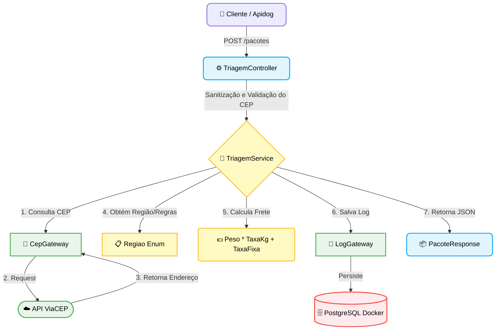

# 🗺️ LogiRoute Project

> Sistema de triagem, cálculo de frete dinâmico e rastreabilidade de rotas de entrega baseado no ViaCEP.

O **LogiRoute** é uma API REST desenvolvida em Java com Spring Boot, estruturada sob os princípios de **Clean Architecture** (Arquitetura Limpa). O objetivo principal é receber dados de pacotes, consultar informações de endereço através da API do ViaCEP, determinar a região logística (Zona/Região), calcular o frete dinamicamente com base em regras de peso/região, indicar a transportadora parceira ideal e registrar um histórico completo de consultas para fins de auditoria.

---

## 🛠️ Tecnologias Utilizadas


---

## 📐 Desenho da Solução (Arquitetura)

A aplicação foi desenhada seguindo os conceitos de **Clean Architecture** e isolamento de domínios. Isso garante que as regras de negócio fiquem completamente independentes de frameworks externos (como o Spring), bancos de dados ou APIs de terceiros.

### Diagrama de Fluxo de Dados:


### Componentes Principais:
1. **Domain (`domain`)**: Contém as regras puras de negócio. O Enum `Regiao` centraliza as taxas, prazos e transportadoras de cada região brasileira, evitando regras espalhadas no código. A entidade `ConsultaLog` modela o registro histórico.
2. **Gateways (`gateway` / `domain`)**: Interfaces que definem as fronteiras do sistema para comunicação com o mundo externo (ViaCEP e Banco de Dados).
3. **Infrastructure (`infrastructure`)**: Configurações de banco de dados, exceptions

## 🌐 Demonstração da API em Produção
* **🚀 Link da API em Produção:** `https://logi-route-project.onrender.com`
> ⚠️ Como a aplicação está hospedada na camada gratuita do Render, a primeira requisição após minutos de inatividade, pode levar cerca de 50 segundos ou mais para responder.

### 🧪 Testando a API em Produção
#### 1. Executar Triagem
* **Endpoint:** `POST https://logi-route-project.onrender.com/pacotes`
* **Payload de entrada:**
```JSON
{
  "cep": "06040100",
  "peso": 20
}
```
* **Resposta esperada - 201 Created:**
```JSON
{
    "cep": "06040-100",
    "uf": "SP",
    "localidade": "Osasco",
    "zona": "Sudeste",
    "transportadora": "LogiExpress Sudeste",
    "prazoDiasUteis": 2,
    "valorFrete": 120.00
}
```
#### 2. Consultar histórico
* **Endpoint:** `GET https://logi-route-project.onrender.com/pacotes/logs`
* **Resposta esperada - 200 OK:**
```JSON
[
    {
        "uf": "SP",
        "localidade": "Osasco",
        "dataHora": "16/07/2026 19:15:21",
        "valorFrete": 120.00,
        "zona": "Sudeste",
        "transportadora": "LogiExpress Sudeste",
        "cep": "06040-100",
        "id": 1
    }
]
```
---
## 👩‍💻 Autor
- Desenvolvido por [@priscyladepaula](https://www.linkedin.com/in/priscyladepaula/)